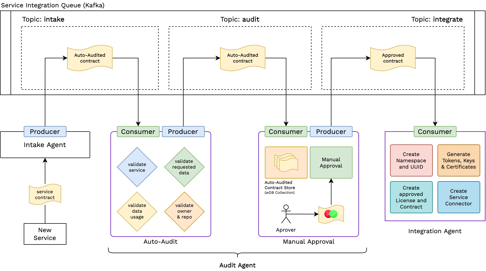

# w-service-manager

Wunder Service Manager is a keystone component of the wunder Platform. It is support to work intandem with [wunder-identity-provider](https://github.com/TanmoySG/wunder-identity-provider) and for onboarded services to use wunder-platform Identities, from WIP for the services.

## Onboarding

Onboarding Service has three primary components (each a MS)
- Intake
- Audit
- Integration

The audit MS is further divided into two components - 
- Auto Validity 
- Manual Approval (currently just a Placeholder service, does nothing)

See [this](./onboarding/README.md)