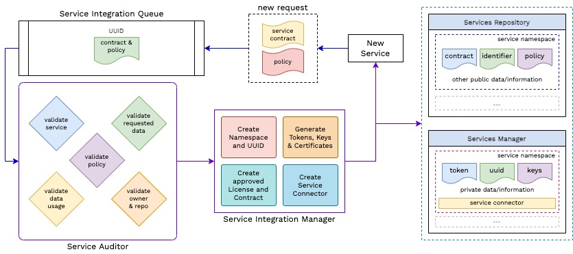

# Notes

Dumping Notes, Thoughts here.

## Service Intake

Service Intake/Onboarding (part of Service Manager) is supposed to help in onboarding new Services onto the WIP for use as Identity Server. 



For any service onboarded onto wIP, it can use wunder sign-up and log-in for identity, and not worry about authentication and storing identities, while working just on the service logic. 

A service that wants to get onboarded, needs to start an onboarding request to the `service-manager`. On the user/service end,
- Service registers a onboarding request
- Service Manager sends a template contract and policy in return. An UUID for the request is also generated and sent.
- These templates need to be filled by the developer/admin of the service with the required details like 
    - What data is required
    - Purpose of the Data
    - Compliance to data-usage instructions
    - details of app/service, etc.
- The Policy also needs to be filled and signed (some mech. that needs to be formulated, some kind of document signing) 
- These are then sent (verification request) to the service manager.
- Service Manager Cross-checks the UUID and the request and puts the request policy and contract on the Service Onboarding Queues.

The Queue stores all the requests and respective microservices(of service manager) use these to onboard a service onto wunder-platform and wIP.

To-Do [1 Aug] 
- Need to find better names for policy and contract 
- or maybe devide contract into request and contract, 
    - with compliance in contract 
    - and usage and other data in request
- Done - 2nd Aug [Next Section](#what-info-we-need-to-capture)

### What info we need to capture?
For Policy, we can have the compliance data and for contract we can have the request body/request data.

#### Contract Request

- **What is a Contract?**

    To use wIP/Wunder-Platform Data, a service needs to have a usage contract with Service Manager that govern the usage of data, access control.

- **What info are in a Contract?**

    Developer Information
    - Email (Official/Representative)
    - Service Dev Rep. Name, Role

    Service Information
    - Service Name
    - Service Repo (if any, open-source)
    - API Structure (TBD - why reqd. , what is this)
    - Service Details (what it does)

    Data Usage and Requirements
    - wP Data Required
    - wP Data Usage Details

- **JSON Schema or Data Types and Schema for Contract**
    
    To-Do [2 Aug]
    - What schema for Contract data can be used? Need to be JSON as well as YML. 
    - Formulate and add in a section of its own and add link here.

- **Access Types**
    - "read" - read
    - "write" - write
    - "create" - create new
    - "delete" - delete
    - "modify" - modify
    - "link" - link w/ something
    - "delink" - delink w/ something
    - `v1` will support only read.

- The following is a valid contract (ignore values) for schema - [contract.service-onboarding](../../schema/contract.service-onboarding.schema.json)
```json
{
  "service": {
    "name": "t",
    "details": [
      "r",
      "t"
    ]
  },
  "data": {
    "gas": {
      "access": "read",
      "use": "d"
    },
    "ta": {
      "access": "read",
      "use": "d"
    }
  },
  "developer": {
    "admin": "t",
    "contributor": "f"
  }
}
```

- Giving `create` permission to a service can help it's users to create an account through the service without requireing the user to seperately create a wunder account. (Need more clarity and ideation on this. probably will be a part of WIP dev and not service manager)

- **What is a Policy?**

    To use wIP/Wunder-Platform Data, a service needs to comply with data-access and usage rules, to safegaurd the dev and user interest, and follow best-practices.

### Exposed Data 

`Q.` What Data do we have in WIP/WPlatform?

Currently only these user-provided data are stored
- Email
- Name/Username
- Password (hashed)

And wIP generated data that are stored are
- UUID
- Tokens

Also, service specific data are generated (only) when a user subscribes to a service. These are
- Service ID 
- Service Name
- Service Access Token
- Service Configs (startup/basic)


## Questions 

[2nd Aug]
- What Data do we expose to a service?
- Which fields do we keep and which we expose?
- Which fields need delegation - second layer of request to get access to (like email)?
    - Delegation may also be in the form of a identifier instead of the actual field itself
    - Which one should it be? Justification for the same?

## Conventions

These conventions should be followed while developing, but also should be revisited frequently as they might change until a solid set of conventions can be formulated.

### Schema Definations

Schemas Definations contain the schemas required to perform any valid request. Certain conventions to be followed (subject to changes)
- Schema Files should be defined in JSON format preferably, though we need YAML Schema as well in future.
- Schema Files should be stored in [`schema` directory](../../schema/)
- Schema Files should be named in the following conventions
```
<schema-name>.schema.json
<schema-name>.schema.yaml

# schema groups can be collective namespace for schemas of simillar kind or origin.
<schema-name>.<schema-group>.schema.json 
...
```
- Defining a Schema should follow - [TBD]

#### Schema Mapping
Schemas defined in the schema directory needs to be mapped in a schema.mapping.json file.
- The Schema Mapping JSON has the schema names, schema groups 
- These are mapped to their respective schema JSONs in the same directory
- Schema Groups are mapped to all their schemas and the schemas mapped to the files.

Example
```json
{
    "shopper" : "schema/shopper.schema.json", 
    "product": {
        "new-product" : "schema/new-product.product.schema.json",
        "product-price" : "schema/product-price.product.schema.json"
    }
}
```