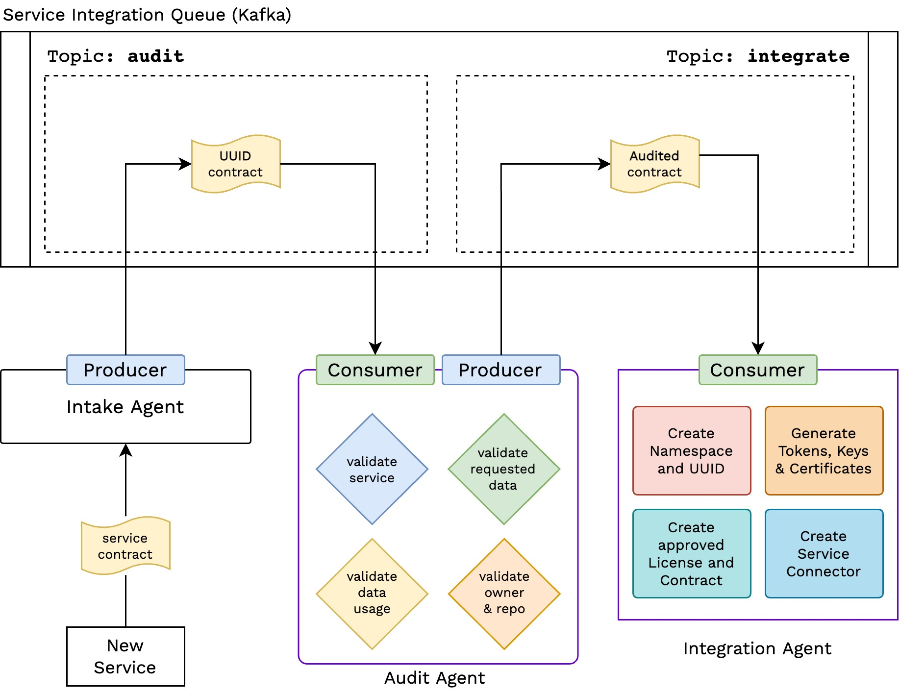

# Notes

Dumping Notes, Thoughts here.

## Service Intake

Service Intake/Onboarding (part of Service Manager) is supposed to help in onboarding new Services onto the WIP for use as Identity Server. 


For any service onboarded onto wIP, it can use wunder sign-up and log-in for identity, and not worry about authentication and storing identities, while working just on the service logic. 

A service that wants to get onboarded, needs to start an onboarding request to the `service-manager`. On the user/service end,
- Service registers a onboarding request
- Service Manager sends a template contract and policy in return. An UUID for the request is also generated and sent.
- These templates need to be filled by the developer/admin of the service with the required details like 
    - What data is required
    - Purpose of the Data
    - Compliance to data-usage instructions
    - details of app/service, etc.
- The Policy also needs to be filled and signed (some mech. that needs to be formulated, some kind of document signing) 
- These are then sent (verification request) to the service manager.
- Service Manager Cross-checks the UUID and the request and puts the request policy and contract on the Service Onboarding Queues.

The Queue stores all the requests and respective microservices(of service manager) use these to onboard a service onto wunder-platform and wIP.

To-Do [1 Aug] 
- Need to find better names for policy and contract 
- or maybe devide contract into request and contract, 
    - with compliance in contract 
    - and usage and other data in request
- Done - 2nd Aug [Next Section](#what-info-we-need-to-capture)

### What info we need to capture?
For Policy, we can have the compliance data and for contract we can have the request body/request data.

#### Contract Request

- **What is a Contract?**

    To use wIP/Wunder-Platform Data, a service needs to have a usage contract with Service Manager that govern the usage of data, access control.

- **What info are in a Contract?**

    Developer Information
    - Email (Official/Representative)
    - Service Dev Rep. Name, Role
    - Modification to the above model (latest - 5 Aug)
      - There will be two levels of dev info
      - Admin and Contributor
      - Admin(s) will have higher level of access with creation, delete, and modification permissions 
      - Contributor(s) have lower level access with limited permissions
      - Both will be a list (array) of emails of admins and contributors with requirement for at least one admin.
      - Admins will get the initial certs and other access related creds. 
      - Admins will be Point-of-Contact for service onboarding.
    
    Service Information
    - Service Name
    - Service Repo (if any, open-source)
    - API Structure (TBD - why reqd. , what is this)
    - Service Details (what it does)

    Data Usage and Requirements
    - wP Data Required
    - wP Data Usage Details

- **JSON Schema or Data Types and Schema for Contract**
    
    To-Do [2 Aug]
    - What schema for Contract data can be used? Need to be JSON as well as YML. 
    - Formulate and add in a section of its own and add link here.

- **Access Types**
    - "read" - read
    - "write" - write
    - "create" - create new
    - "delete" - delete
    - "modify" - modify
    - "link" - link w/ something
    - "delink" - delink w/ something
    - `v1` will support only read.

- The following is a valid contract (ignore values) for schema - [contract.service-onboarding](../../schema/contract.service-onboarding.schema.json)
```json
{
  "kind" : "contract.service-onboarding",
  "service": {
    "name": "placeholders",
    "respository" : "link.to.placeholders",
    "details": [
      "A service to store Block data Files",
      "Block Storage"
    ]
  },
  "data": {
    "name": {
      "access": ["read"],
      "use": "Primary Identifier"
    },
    "service_access_token": {
      "access": ["read"],
      "use": "Access Propagation"
    }
  },
  "developer": {
    "admin": ["tanmoysg@gmail.com", "tsgupta@mail.com"],
    "contributor": []
  }
}
```

- Giving `create` permission to a service can help it's users to create an account through the service without requireing the user to seperately create a wunder account. (Need more clarity and ideation on this. probably will be a part of WIP dev and not service manager)

- **What is a Policy?** [shelved for future versions]

    To use wIP/Wunder-Platform Data, a service needs to comply with data-access and usage rules, to safegaurd the dev and user interest, and follow best-practices.

    To Dos
    - Need to formulate Policy in a structured manner.
    - What Clause gets covered?
    - Why Policy? Need to get this right
    - What does policy technically provide?
    - What goes into policy?
    - How to add policy?
    - How to enforce policy?
    - Can Policy be replaced with something more security-wise enforcing?

### Exposable Data 

`Q.` What Data do we have in WIP/WPlatform?

Currently only these user-provided data are stored
- Email `exposable`
- Name/Username `exposable`
- Password (hashed)

And wIP generated data that are stored are
- UUID 
  - Service Specific UUID - non wIP `exposable` - same as service id
- Tokens

Also, service specific data are generated (only) when a user subscribes to a service. These are
- Service ID `exposable` - Service Specific UUID
- Service Name `should already be with the service`
- Service Access Token `exposable`
- Service Configs (startup/basic) [need to formulate how an onboarded service can load initial configs into wIP]

Note
- service-user-uuid (a layer of service specific uuid, to mask/protect wIP UUID)
- service-id (can be merged with service-user-uuid)

## Exposed Data

Based on [Exposable Data Fields](#exposable-data), the following fields can be exposed.

- email
- username
- service-id 
- service-access-token

| Field | Description | Technical Name (code friendly name) | Allowable Access (in v1) |
| ----- | ----------- | ----------------------------------- | ------------------------ |
| Email | Email of user | email | read |
| Name  | Name/Username of User | username | read |
| Service ID | Service Specific UUID | service-id | read | 
| Service Access Token | Service Specific Access token | service-access-token | read , create |

## Kafka Setup



## Questions 

[2nd Aug]
- What Data do we expose to a service? [Ref.](#exposed-data)
- Which fields do we keep and which we expose? [Ref.](#exposable-data)
- Which fields need delegation - second layer of request to get access to (like email)?
    - Delegation may also be in the form of a identifier instead of the actual field itself
    - Which one should it be? Justification for the same?

[7th Aug]
- The Topics Identified are audit and integrate/integration. Do we need more topics for intermediate steps?
  - If yes what and why?
- Do we need a step to get uuid and contract template first and have a topic for that?

[9th Aug]
- Audit Needs two Steps - One Automatic and another manual
  - Auto Audit checks the contract 
  - Add more details from NOTEBOOK

## Conventions

These conventions should be followed while developing, but also should be revisited frequently as they might change until a solid set of conventions can be formulated.

### Schema Definations

Schemas Definations contain the schemas required to perform any valid request. Certain conventions to be followed (subject to changes)
- Schema Files should be defined in JSON format preferably, though we need YAML Schema as well in future.
- Schema Files should be stored in [`schema` directory](../../schema/)
- Schema Files should be named in the following conventions
```
<schema-name>.schema.json
<schema-name>.schema.yaml

# schema groups can be collective namespace for schemas of simillar kind or origin.
<schema-name>.<schema-group>.schema.json 
...
```
- Defining a Schema should follow - [TBD]

#### Schema Mapping
Schemas defined in the schema directory needs to be mapped in a schema.mapping.json file.
- The Schema Mapping JSON has the schema names, schema groups 
- These are mapped to their respective schema JSONs in the same directory
- Schema Groups are mapped to all their schemas and the schemas mapped to the files.

Example
```json
{
    "shopper" : "schema/shopper.schema.json",
    "product": {
        "new-product" : "schema/new-product.product.schema.json",
        "product-price" : "schema/product-price.product.schema.json"
    }
}
```